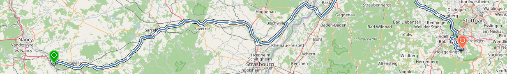
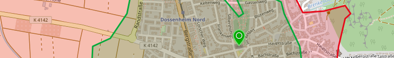

Overview
========

**OpenRouteService** (ORS) offers global spatial services by utilizing user-generated and collaboratively collected free geographic data from **OpenStreetMap.org**. The API currently comprises a geocoding, routing and isochrone endpoint allowing you to consume its results in your applications. By accessing, requesting and using the ORS API, you are agreeing to our :ref:`terms of use <tos-ref>`. 

To get started with the service, you first need to obtain an API key. Sign up at https://openrouteservice.org/developers to create and manage your ORS access. Please be aware that there are limitations on requests to avoid individual users from degrading the overall system performance.

Feel free to browse to `OpenRouteService.org <www.openrouteservice.org>`_ in order to see a demonstration of the ORS API.

ORS Routing
-------

The **ORS Routing** service works globally and allows you to determine travel routes and navigation information. To this end, we offer a wide range of travelling options for different profiles. Amongst these you may choose between car, bike, foot, wheelchair or heavy vehicle. Additionally ORS offers the possibility to customize and individualize the selected profile with specific settings. 

ORS Geocoding
---------

The **ORS Geocoding** service accesses global databases and transforms a description of a location, such as a place name, street address or postal code, into a normalized description of the location with a point geometry. Additionaly ORS Geocoding offers a reverse geocoding service which does exactly the opposite. It transforms the coordinate of a point into the description of the next enclosing object which surrounds the given coordinate. To obtain more relevant results you may also set a radius tolerance around the requested coordinates.

.. image:: _images/geocode.png
	:width: 700px
	:alt: Geocoding Image

ORS Isochrones
----------

The **ORS Isochrones** service helps you determine the maximum reachability area from a given point(s) on the map and returns these regions as contours of polygons. In this context you may specify two different types of input, namely the time or the distance as well as corresponding intervals. If your input consists of a list of points the service will return intersections of the isochrones if any exist. Additionaly you are able to use the same set of profiles and settings as in ORS Routing.

